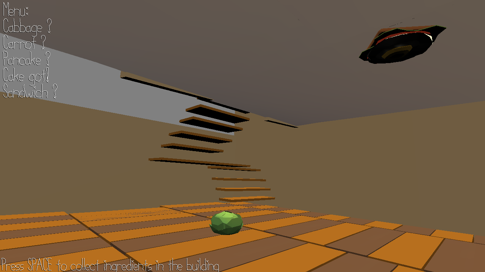

# Food Maze

Author: Fengying Yang & Yunfei Cheng

Design: 

- Foods are distributed randomly in this building.
- Your task is to collect all foods.

Screen Shot:

How To Play:

- W/A/S/D to walk in the room
- SPACE to collect the ingredients

Sources: 

- [Loop003-jungle.wav](https://freesound.org/people/bebeto/sounds/18973/) by [bebeto](https://freesound.org/people/bebeto/)
- cake, sandwich, pancake from `brunch.blend`
- rail from `phone-bank.blend`
- grass from `city.blend`
- carrot, cabbage from `garden.blend`

This game was built with [NEST](NEST.md).
